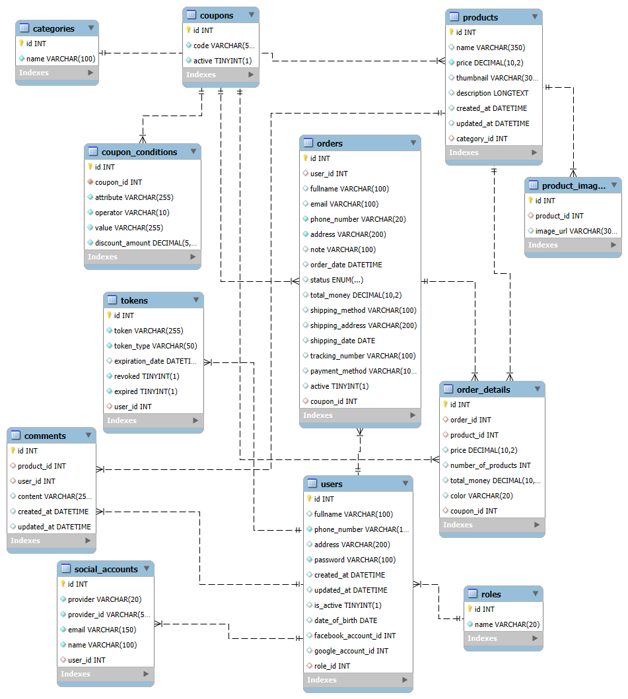

# 🛍️ ZShop – E-commerce RESTful API System

ZShop is a RESTful API system built for an e-commerce platform. It provides core features such as user management, product and category management, order processing, coupon and discount handling, product reviews, authentication and authorization, social login integration, and multi-language support.

## 📌 Features

- ✅ User registration and login (including social login via Google/Facebook)
- ✅ User profile and role management (admin, customer)
- ✅ Product and category management with multiple images
- ✅ Order and order detail management with status tracking
- ✅ Coupon and discount management with flexible conditions
- ✅ Product reviews/comments from verified users
- ✅ Authentication with JWT, token revocation, and refresh tokens
- ✅ Multi-language support (i18n)
- ✅ Logging, configuration, and database migration via Flyway

## 👥 Target Users

- **Customers**: Browse products, place orders, write reviews
- **Admins**: Manage all system data (users, products, orders, etc.)

## 🧩 Entity Relationship Diagram (ERD)

### Key Relationships:

- **Users & Roles**: Each user is assigned a role (e.g., admin or customer).
- **Users & Tokens**: Users may have multiple login tokens for different devices or sessions.
- **Users & Orders**: A user can place many orders.
- **Orders & Order Details**: Each order contains multiple products (order details).
- **Products & Categories**: Each product belongs to a category.
- **Products & Product Images**: A product can have multiple images.
- **Products & Comments**: Users can leave reviews for purchased products.
- **Coupons & Orders / Order Details**: Coupons can be applied to entire orders or individual items.
- **Coupon Conditions**: Coupons have rules/conditions to be met (e.g., min price).
- **Social Accounts**: Users can link their social login from Google or Facebook.

### 📷 ERD Diagram:

